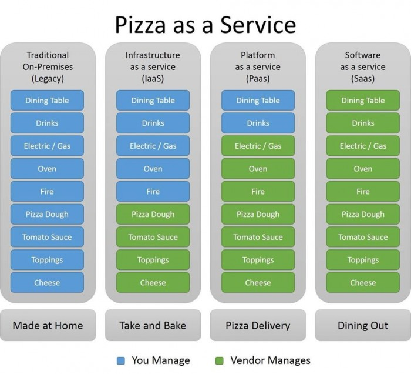

import Link from '@docusaurus/Link';

# Week 2

## Tuesday
- No Meeting

## Thursday

- **Date:** September 12, Thursday
- **Time:** 6:30pm-8:00pm

### 🚩 Agenda
1. Sign in with attendance code
2. Complete simple form from presentation
3. Presentation
4. Break for Pizza
5. Hands-on: Starting PhotoSky

### 📓 Kickoff Meeting Notes
[Club Presentation](https://studentuml.sharepoint.com/:p:/s/UMLCloudComputingClub/ERs7iVhp-bVOjoOP7s_kZnQBIMa0QhztQCucu83zM7NHxA?e=ewRg88)
 

**📄 Attendance**
- In-Person: Roughly **42**
- Virtual: **2-3**
 

#### 🧊 Ice Breaker:
What people like about the cloud/their cause to learn more:
1. To expand their technical skills (Learn more about the subject)
2. The ability to launch computing resources with code
3. Love the serverless design of the cloud
  

#### 🏎️ Fast facts:
- The value of the industry
    - 94% of enterprises use cloud services.
    - 70%+ companies intend to increase their cloud budgets. 
    - Projected to be valued at $832.1 Billion by 2025. 
- Some Companies have a mix of cloud and on-prem. Some companies are purely cloud based.
- Cloud is practically limitless in resource and potential.
- Cloud computing is designed with security in mind, implementations are naturally pro-security (authenitcation at every step). 
- Cloud has been a major part of supporting remote work from a technical perspective.
  

#### ✏️ Definitions:
What is cloud computing:
- A model to enable access to resources via the internet
- More features/constraints make it more specific, generally a way of enabling computing resources via the internet. 
    - Typically recognized as easy to use, powerful, and scalable.
- What is a Computing resource?
    - Computing resources can vary for different people and different needs. 
    - Can be storage solution
    - Can be a database
    - Can be a general program hosting service
    - Can be a entire platform to host your product
    - ...
  

#### 🏢 Real world applications of the cloud:
- Data recovery, disaster recovery
- Website hosting
- Big data analytics & ML through the cloud infrastructure 
- Software dev (Remote work, development vs. production development, segmentation of resources, etc)
- VDI
- CDN
- IoT
- Video and auto streaming
- Email and productivity apps
- CRM and ERP systems
 

#### ☁️ Cloud Computing Models:
Public Cloud
- Provided through vendors like Amazon, Microsoft, Google, IBM, & Oracle
Private Cloud
- Also provided by similar vendors. 
- These are reserved spaces within the cloud the are partitioned/separated from other parts of the cloud. 
- They are dedicated to a single organization. 
Hybrid Cloud
- A mixture of public + private cloud
- Offers more flexibility and availability
- Distribute workload depending on sensitivity
 

IaaS (Infrastucture as a Service):
- Third-party provider hosts and maintains the infrastructure:
    - Storage
    - Servers
    - Networking
    - Virtualization
    - etc.
- Typical to rent infrastructure and run your applications.
- Examples:
    - AWS (Amazon Web Services)
    - Microsoft Azure
    - GCP (Google Cloud Platform)
    - IBM Cloud
    - Oracle Cloud
 

PaaS (Platform as a Service):
- Third-party provider offers a platform for users to build, deploy, and manage their applications.
- Offer tools & services for application development, deployment, & scaling. 
- Also include middleware, databse management, etc.
- Examples:
    - Heroku
    - Google App Engine
    - Microsoft Azure
    - AWS Elastic Beanstalk
 

SaaS (Software as a Service):
- Third-party provider hosts and delivers software applications over the internet.
- Access applications through the web browser or API. 
- Provider manages all aspects:
    - Software
    - Maintenance
    - Security
    - Upgrades
    - etc.
- Examples:
    - G-Suite (Gmail, Google Drive, Google Docs, etc)
    - Microsoft 365 (OneDrive, Outlook, Word, PowerPoint, etc)
    - Dropbox
    - Zoom
    - Slack
    - Adobe Creative Cloud
    - ...

 

**🍕 Pizza as a Service Analogy**  

  

#### 📊 Pros & Cons
**IaaS Pros**
- Scalability
- Pay as you go
- Easy to manage
- Geographical flexibility

**IaaS Cons**
- Security Risks (Someone else's infrastructure)
- Dependency for availability of computing resources
- Complexity in management (steep learning curve to manage resources)
- Custimization restrictions to infrastructure design
 

**PaaS Pros**
- Quick Deployment
    - Automation with a CI/CD pipeline enables quick, fast, and automated deployment.
- Scalability
    - Capable of responding to resource needs based on traffic, computational complexity, or any dynamic resource needs. 
- Cost-effective
    - Pay as you go model ensures you pay for only how much you use, not for just keeping the servers running.
- Easy collaboration
    - Through the availability of shared computing resources on teh cloud
- Reduced complexity of managing infrastructure
    - Shared resources and easier centralization of resource allocation enables easier management.

**PaaS Cons**
- Limited Control of infrastructure
    - Products can be limited in design and functionality due to the platform's capabilities.
- Vendor lock-in
    - Similar to a stragety that Apple uses. 
    - Too dependent on a particular Cloud ecosystem that can become tech debt or a financial burden.
- Security concerns on infrastructure
    - Your code is running on someone else's infrastructure.
    - Although, most cloud security breaches are caused by human sourced errors rather than any technical issues.
- Customization limitations
    - Limitations to the workings of the infrastructure.
 

**SaaS Pros**
- Low up-front costs
- Easily deploy + manage
- Accessible from anywhere
- Scalable

**SaaS Cons**
- Dependence on the provider
- Customization limitations
- Security concerns
- Integration Limitations
 

#### ⚙️ Key Cloud technologies:
- Cloud Storage
- Databases
- Cloud Security
- Cloud Networking
  

#### 🔬 Demo
Presented a short Discord Bot Demo using the power of AWS Lambda functions
Current working implementation is available within Discord [Bot channel](https://discord.gg/TcqupVuz) as the `API Alex Testing` bot.
 

**Pizza Break 🍕**

#### 🚀 Next meeting(s)

We will be working on <Link to="https://umlcloudcomputing.org/docs/activities/PhotoSky/intro">PhotoSky</Link> and review some fundamentals of CS development with <Link to="/docs/category/basics">Git</Link>!
