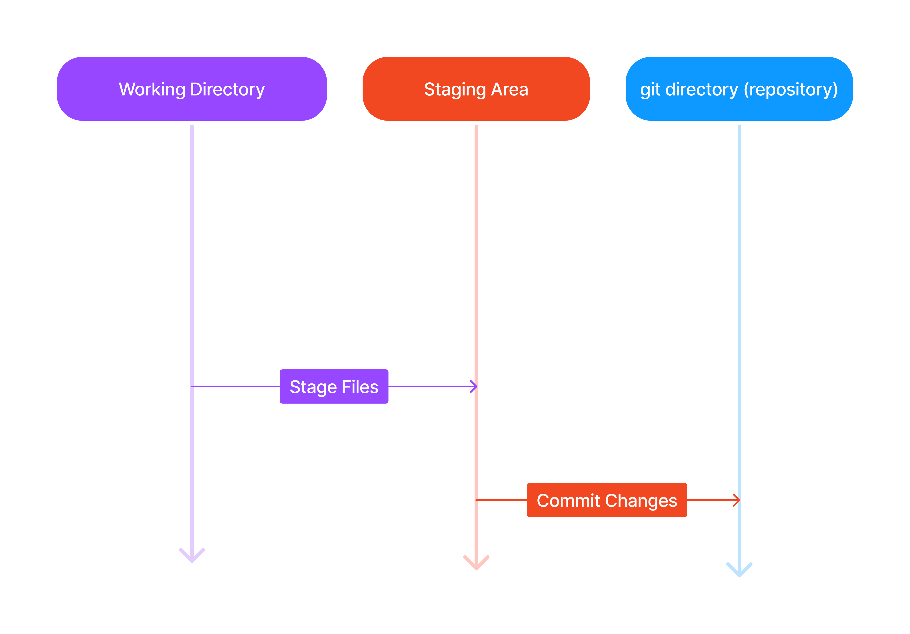

--- 
sidebar_position: 5
---

# Commits



Commits keep track of progress and changes as we work. Git treats each [`commit`](./Index.md#commit) as a "save point". It's a point in the project which can be reverted to if a bug is found, or you want to make a change. 

Whenever performing a [`commit`](./Index.md#commit), **always** include a commit **message**. 
It's always best practice to do so and improves understanding of your code for others and subsequently maintainability of your project. 

``` bash
[user@localhost] $ git commit -m "init commit"
[master (root-commit) d3d38f6] init commit
 3 files changed, 23 insertions(+)
 create mode 100644 README.md
 create mode 100644 index.html
 create mode 100644 styles.css
```

`git commit` performs a commit and the `-m `*`"message"`* adds a message to the commit. <br/>
Now the staging area has been committed to the repository with the message "init commit".

There are general [guidelines](https://www.conventionalcommits.org/en/v1.0.0/) for writing git commit message which are common in industry. It's **highly valuable** to be aware of these practices to write effective and informative commit messages. 

### Git Commits without staging

Sometimes when small changes are made, the staging area can seem like a hassle. Hence, it's convienient to commit directly and avoid the staging area. <br/>
By using the `-a` option on `git commit`, it's possible to stage every changed and already tracked file. 

To show this let's update `index.html` slightly:
``` html
<!DOCTYPE html>
<html>
    <head>
        <title>Hello World!</title>
        <link rel="stylesheet" href="styles.css">
    </head>

    <body>
        <h1>Hello world!</h1>
        <p>This is the first file in my new Git Repo.</p>
        <p>A new line within our page!</p>
    </body>
</html>
```

:::info

Recall, to open a file to edit in your working directory with [Vim](./Index.md#vim), enter the command `vim `*`filename`* and enter insert mode (`I` key on the keyboard). To save and exit enter normal mode (`esc` key) and enter the command `:wq` (write and quit).

:::

Now let's check the status of our [repo](./Index.md#repository-repo), however with the `--short` option to get a more compact response:
``` bash 
[user@localhost] $ git status --short
                   M index.html
```
> Note: The `--short` option on `git status` is also synonymous with `-s`. Hence, either `git status -s` or `git status --short` can be used to perform the same action.

Here's some valuable [information](./Index.md#git-status-short) about short git status flags.

Now let's commit directly:
``` bash
[user@localhost] $ git commit -a -m "feat: Added a new line in index.html"
                   feat: Added a new line in index.html
                   1 file changed, 1 insertion(+)
```
> Notice how the commit message follows the [conventional commits](https://www.conventionalcommits.org/en/v1.0.0/) structure.

:::warning

Warning: It's typically not best practice to skip the staging area since it's possible to accidentally commit unwanted changes. Commit carefully. 

:::

In order to view the commit history of your repository, use the `log` command:
``` bash
[user@localhost] $ git log
                    commit c4c4abe5c0156a5626cdafc1e5722d5b2b23e833 (HEAD -> master)
                    Author: example user <user@example.com>
                    Date:   Sun Jul 21 14:12:35 2024 -0400

                        feat: Added a new line in index.html

                    commit d3d38f65bb0bde98b47a6747d8d02b2e53bd0bcb
                    Author: example user <user@example.com>
                    Date:   Sun Jul 21 13:46:57 2024 -0400

                        init commit
```