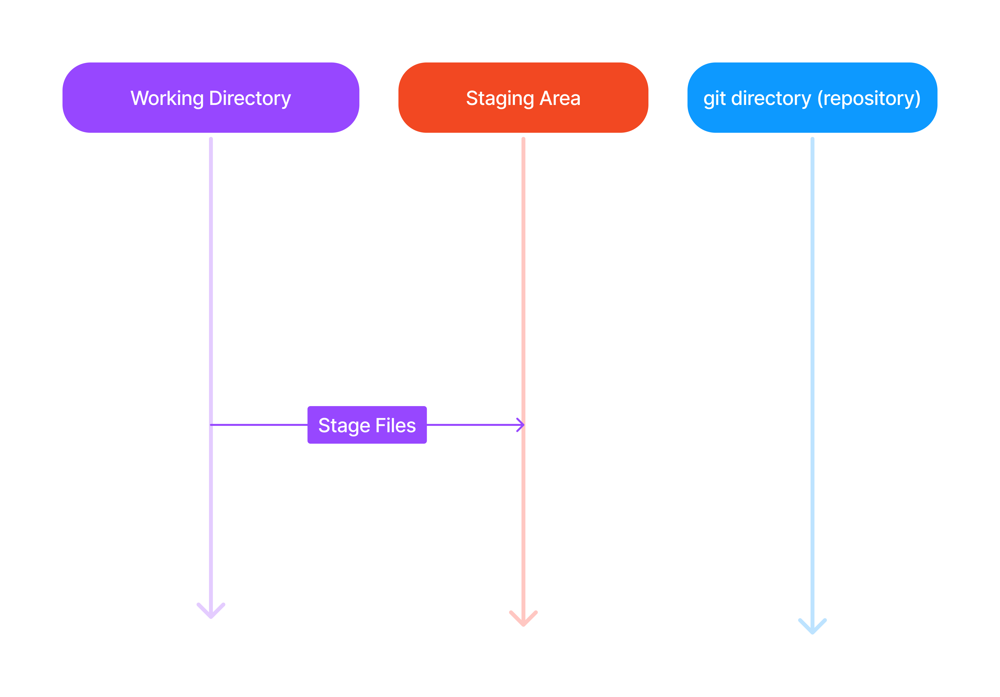

# Staging Area



As you are working on a project, you add, edit, and remove files. When you reach a satisfactory point, you should add the files to a staging area.

[Staged](Index.md#stage) files are ready to be [committed](./Index.md#commit) to your working repository. 

Back to our `newProject`, we can now make `index.html` as a tracked file by simple adding it to the staging area using `git add`:
``` shell
[user@localhost] $ git add index.html
```

Now `index.html` should be [staged](./Index.md#stage):
``` shell
[user@localhost] $ git status
                  On branch master

                  No commits yet

                  Changes to be committed:
                    (use "git rm --cached <file>..." to unstage)
                            new file:   index.html
```

In other words, the file is now added to the staging area!

### Staging more than one file

It's often that we end up modifying more than one file within a project before we decide to [stage](./Index.md#stage) them. Let's see how to [stage](./Index.md#stage) them all at once:

Let's start by adding a `README.md` file to our repository to describe it:
``` shell
[user@localhost] $ vim README.md
```
and add the following content:
``` md
# Hello world
This repository exists as part of a git tutorial!
```
>Recall to use the `:wq` command in [Vim](./Index.md#vim) to write and quit.

Let's also add a CSS file called `styles.css`:
``` shell
[user@localhost] $ vim styles.css
```
and add the following content:
``` css
@keyframes ani {
    from {background-color: #4038e6;}
    to {backgorund-color: #9e99ff;}
}
body {
    background-color: #4038e6;
    animation-name: ani;
    animation-duration: 4s;
}
```
>Again, recall to use the `:wq` command in [Vim](./Index.md#vim) to write and quit.

Finally let's update `index.html` to include our new stylesheet (`styles.css`):
``` shell
[user@localhost] $ vim index.html
```
``` html
<!DOCTYPE html>
<html>
    <head>
        <title>Hello World!</title>
        <link rel="stylesheet" href="styles.css">
    </head>

    <body>
        <h1>Hello world!</h1>
        <p>This is the first file in my new Git Repo.</p>
    </body>
</html>
```
> Once again, recall to use the `:wq` command in [Vim](./Index.md#vim) to write and quit.

Now let's add all these new files and changes to our staging area using the following command:
``` shell
 git add --all
```

Using the `--all` option will stage all changes which includes any new files, modified files, or deleted files. 

Now checking via `git status`:
``` shell
[user@localhost] $ git status
                   On branch master
  
                   No commits yet

                   Changes to be committed:
                   (use "git rm --cached <file>..." to unstage)
                           new file:   README.md
                           new file:   index.html
                           new file:   styles.css
```

We can now do commits since all three files are in the staging area!

>The alternative option synonymous with `--all` is `-A`. Hence, `git add --all` is equivalent to `git add -A`.
